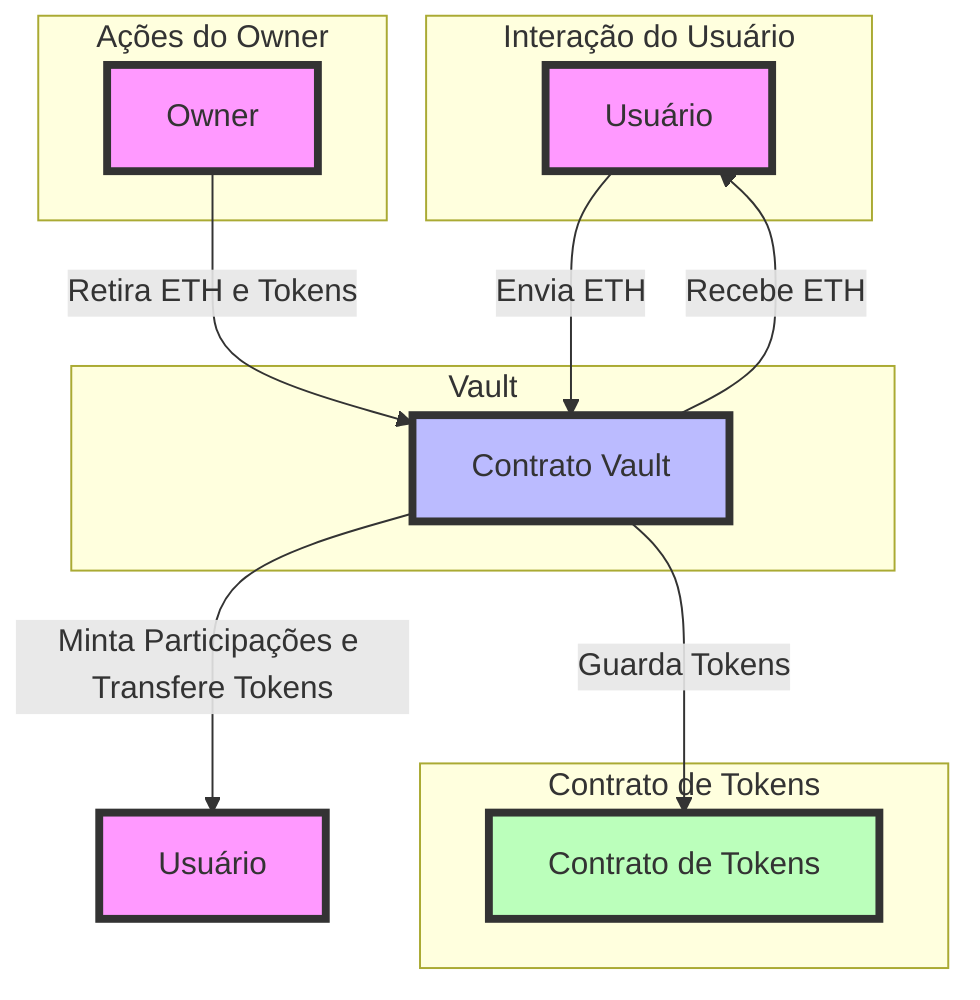

## Diagrama

```mermaid
graph TD
    A[Usuário] -->|Envia ETH| B[Contrato Vault]
    B -->|Minta Participações e Transfere Tokens| C[Usuário]
    B -->|Recebe ETH| A
    D[Owner] -->|Retira ETH e Tokens| B
    B -->|Guarda Tokens| E[Contrato de Tokens]
    
    subgraph Interação do Usuário
        A
    end
    
    subgraph Vault
        B
    end
    
    subgraph Contrato de Tokens
        E
    end
    
    subgraph Ações do Owner
        D
    end
    
    class A,C,D user;
    class B vault;
    class E token;
    
    classDef user fill:#f9f,stroke:#333,stroke-width:4px;
    classDef vault fill:#bbf,stroke:#333,stroke-width:4px;
    classDef token fill:#bfb,stroke:#333,stroke-width:4px;
```
