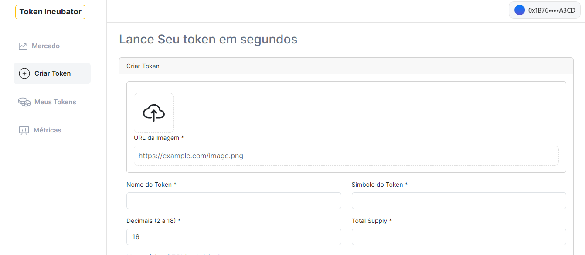
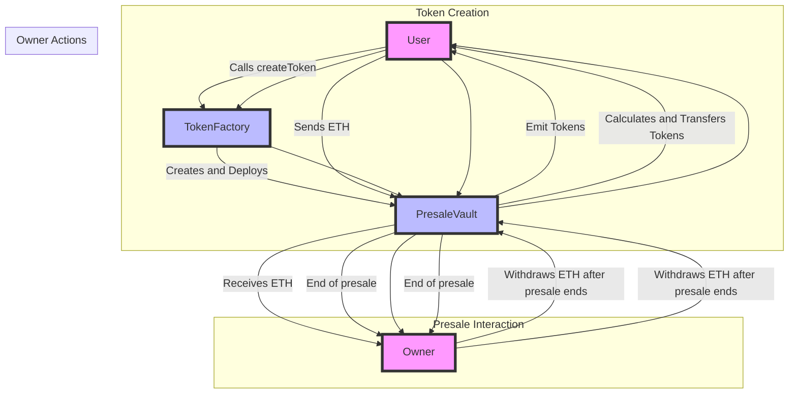

## TokenFactory: Simplifying Token Creation and Fundraising for Crypto Projects

### Summary

TokenFactory is a smart contract platform designed to streamline the creation and fundraising process for crypto projects. It leverages the ERC4626 vault standard, inheriting ERC20 token characteristics, to enable easy creation and presale of tokens with the following steps:

1. **Token Creation**: Users (developers or entrepreneurs) can create a new token by calling the `createToken` function in the TokenFactory contract. They need to provide the token details (name, symbol, decimals, total supply, and hard cap) and pay a creation fee.

2. **PresaleVault Deployment**: Upon creation, the TokenFactory deploys a new PresaleVault (an ERC4626 vault) for the presale of the new token. The vault manages the presale process, ensuring that the funds raised are securely stored.

3. **Presale Interaction**: Investors can participate in the presale by sending ETH to the PresaleVault. The vault calculates the number of tokens to be issued based on the amount of ETH sent and the token price, then transfers the tokens to the investor.

4. **End of Presale**: Once the hard cap is reached or the presale ends, the vault disallows further contributions. The owner of the contract can withdraw the funds raised only after the presale has ended, ensuring transparency and security.

### Diagram

### Legend:
- **User**: Developer or Entrepreneur who wants to create and launch a token.
- **TokenFactory**: Contract responsible for creating new presale tokens.
- **PresaleVault**: ERC4626 vault that manages the presale and stores the raised funds.
- **Owner**: Owner of the contract who receives the raised funds and manages the presale. Can only withdraw the raised amount after the presale ends.

### Contract Addresses

- **LAChain**: [0x103021D576076d0bA933E8f4e0f82EB7Ecc68E1A](https://testexplorer.lachain.network/address/0x103021D576076d0bA933E8f4e0f82EB7Ecc68E1A)
- **XRPL EVM Sidechain**: [0x103021D576076d0bA933E8f4e0f82EB7Ecc68E1A](https://explorer.xrplevm.org/address/0x103021D576076d0bA933E8f4e0f82EB7Ecc68E1A)

